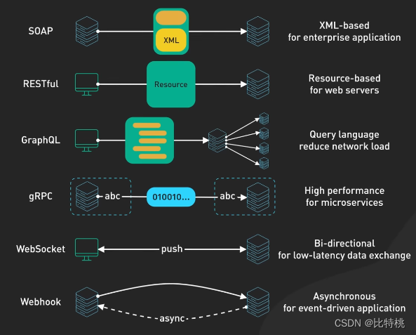

# API架构对比

| 任务名称 | MYY-9 调研-接口框架           | 
|------|-------------------------|
| 提交作者 | gsq                     | 
| 提交时间 | 2024-08-14              | 
| 文件名  | api_arch_investigate.md | 

# 一、概述

## 1、相关背景

MYY的CDP需要面向前端小程序、Web前端、数据分析师、AI算法工程师等多种用户，并为他们提供易用、高效、可维护的API接口。

在现代的软件工程中，API是微服务或在客户端与服务端之间的信息传递的方式，

每一种模式，都有其特点和合适的使用场景，
需要对三种风格做一个深入的理解和对比，以方便我们在做技术选型时，能够做出有效的决策。

## 2、意义

- 选择合适的API架构风格，能够提高系统的可扩展性、可维护性和可用性。
- 通过API接口，可以实现系统的解耦，降低系统的耦合度，提高系统的灵活性和可重用性。

# 三、业内方案调研

按照API的特征，一般可以将其分为一下几类：

* Web API：RESTful
* 查询 API：GraphQL
* RPC API ：SOAP 和 gRPC
* 实时通信API：websocket

## 1、RESTful

#### **架构介绍**

RESTful API在移动互联网时代中有着广泛的应用，因为它足够的轻量（基于JSON），非常灵活。REST API规定了许多标准，比如：统一接口、通讯方式、无状态、可缓存等。

#### **使用场景**

1. **管理 API**。在系统中，专注于管理对象并面向许多使用者的 API 是最常见的 API 类型。REST 帮助此类 API 具有强大的可发现性，良好的文档编制，因此
   REST 非常适合此对象模型。
2. **简单的资源驱动型应用程序**。在用于连接不需要查询灵活性的资源驱动型应用时，REST 是一种非常有效的方法。

#### **实现原理**

RESTful 的定义并不像 SOAP 那样严格。RESTful 体系结构应该遵守如下六个体系结构约束：

1. 统一接口：无论设备或应用程序类型如何，都可以采用统一的方式与给定的服务端进行交互；

2. 无状态：请求本身包含处理该请求所需要的状态，并且服务端不存储与会话相关的任何内容

3. 缓存

4. 客户端-服务器体系结构：允许双方独立发展

5. 应用程序的层级系统

6. 服务端向客户端提供可执行代码的能力

在 REST 中，使用例如 GET、POST、PUT、DELETE、OPTIONS 可能还有 PATCH 等 HTTP 方法来完成操作。支持的方法类型和描述信息：

1. **GET**：获取资源详情或资源列表。对于collection类型的URI（比如**/customers**）就是获取资源列表，对于item类型的URI（比如**
   /customers/1**）就是获取一个资源。
2. **POST**：创建资源，请求体是新资源的内容。往往POST是用于为集合新增资源。
3. **PUT**：创建或修改资源，请求体是新资源的内容。往往PUT用于单个资源的新增或修改。实现上必须幂等。
4. **PATCH**：部分修改资源，请求体是修改的那部分内容。PUT一般要求提交整个资源进行修改，而PATCH用于修改部分内容（比如某个属性）。
5. **DELETE**：移除资源。和GET一样，对于collection类型的URI（比如**/customers**）就是删除所有资源，对于item类型的URI（比如**
   /customers/1**）就是删除一个资源。

此外还需要注意RESTful下的幂等性问题，启动POST方法不具备幂等性，多次提交会导致多次创建相同对象，需要做好幂等性控制。

#### **优点和缺点**

优点：

1. 轻量级数据格式交互：RESTful API架构一般使用json数据格式来进行通信，相比于SOAP的XML格式根据简单和轻量级，所以非常适合web前后端的数据交换。
2. **客户端和服务端的解耦**：由于 REST 尽可能地解耦了客户端和服务端，REST 相较于 RPC
   可以提供更好的抽象性。具有抽象级别的系统能够封装其实现细节，以更好的标示和维持它的属性。这使得 REST API
   足够灵活，可以随着时间的推移而发展，同时保持稳定的系统。
3. **可发现性**：客户端和服务端之间的通信描述了所有内容，因此不需要外部文档即可了解如何与 REST API 进行交互。
4. **缓存友好**：REST 重用了许多 HTTP 工具，也是唯一一种可以在 HTTP 层面上缓存数据的 API 架构风格。 与其相对的是，在任何其他
   API 上实现缓存都需要配置其他缓存模块。
5. **多种格式支持**：REST 拥有支持多种格式用于存储和交换数据的能力，这是它如今成为搭建公共 API 的主要选择的原因之一。

缺点：

1. **没有标准的 REST 结构**：在构建 REST API 方面，没有具体的正确方法。 如何对资源进行建模以及哪些资源需要建模取决于不同的情况。这使得
   REST 在理论上很简单，但在实践中却很困难。
2. **庞大的负载：**REST 会返回大量丰富的元数据，以便客户端可以仅从响应中了解有关应用程序状态的所有必要信息。对于具有大量带宽容量的大型网络系统来说，这种“啰嗦”的通信并不算很大的负载。但带宽容量并非总是足够的。
   这也是 Facebook 在 2012 年提出 GraphQL 架构风格的关键驱动因素。
3. **响应过度和响应不足问题**。 REST 的响应包含的数据会过多或不足，通常会导致客户端需要发送另一个请求。

特点：

- 简单、轻量级、易于理解和学习
- 基于HTTP标准方法和状态码，易于扩展和集成
- 有缓存
- 高耦合

评论：

- 非常依赖接口设计
- 前后端耦合度高，前端新增一个功能需要后端新增一个接口
- 开发难度低，不需要什么额外的库

## 2、GraphQL

Meta 公司开发的接口协议，目前 Github、Shopify、Ins 等均在使用。最大的特点就是灵活性和高效率，对于其产品有复杂数据要求的，提供了很好的选择方案。GraphQL
和我们刚刚说的 RESTful API 有很多相似之处，比如它们都是基于http、均通过 URL 进行统一资源定位、数据传输采用 JSON 格式。但GraphQL
独有的优势在于，客户端可定制化的选择接口返回的内容，这极大的提高了程序的动态扩展能力。

如果我们一个动作需要多个数据的组合，那在 RESTful API 中，可能面临多个请求。但在GraphQL中可以在请求头中进行数据定制，GraphQL
将组织好数据进行返回。

但它也有一定缺陷，一方面是不易进行缓存。GraphQL具有单一入口点，并且默认使用 HTTP POST，会妨碍 HTTP
缓存的充分利用。另一方面是因为可以随意自定义数据，这会可能会产生一些危险。

特点：

-

评论：

-

## 3、gRPC

#### **架构介绍**

RPC(Remote Procedure Call)
远程过程调用，也就是说两台服务器A，B，一个应用部署在A服务器上，想要调用B服务器上应用提供的方法。由于不在一个内存空间，不能直接调用，需要通过网络来表达调用的语义和传达调用的数据。远程过程调用是一种允许在不同上下文中远程执行函数的规范。
RPC 扩展了本地过程调用的概念，并将其放在 HTTP API 的上下文中。

#### **使用场景**

**用于内部微服务的客户特定的 API**。由于是在单个提供者和单个使用者之间建立直接的集成，我们不想像 REST API
那样，花太多时间通过网络传输大量的元数据。凭借高消息速率和消息性能，gRPC 和 Twirp 成为了用于微服务的可靠用例。通过在底层使用
HTTP 2，gRPC 能优化网络层，使其非常高效地在不同服务之间每天传送大量信息。然而，如果你并不是要着眼于提高网络性能，而是要在发布高度独立的微服务团队之间建立一个稳定的
API 联系。REST 就能做到。

#### **实现原理**

RPC客户端调用一个远程的过程，将参数和附加信息序列化为消息，然后将消息发送到服务端。服务端在接受到消息后，将信息的内容反序列化，执行所请求的操作，然后将结果发送回客户端。客户端和服务端各自负责参数的序列化和反序列化。

gRPC是PRC的一种非常流程的实现框架，gRPC 是Google 2016年创建的开源远程过程调用框架，它重写了他们过年的内部RPC基础设施并开源出来。gRPC
是 RPC 的一种流行实现，许多组织已采用 gPRC 作为首选的 RPC 实现方案。还有Openfeign、Dubbo这种框架也可以作为 RPC
的实现方案。  
gRPC生态系统的核心是使用 Protocal Buffers （协议缓冲区）作为其数据交换格式。它是一种和语言及平台无关的机制，用于编码结构化数据。之所以
gRPC 具有超高的性能，Protocol Buffers 的通讯方案是重点。它是一种非常高效的二进制编码格式，比 JSON 快得多。

另一个高效率的原因是，gRPC 构建在HTTP/2 之上，以提供大规模的高性能基础。gRPC使用 HTTP/2
Stream，它允许通过单个长期的TCP连接发送多个消息流。HTTP/2 的好处有：多路复用、流优先、二进制协议、服务推送。

#### **优点和缺点**

**优点**：

1. **简单直接的交互**RPC 使用 GET 来获取信息，使用 POST 来处理其他所有操作。服务端和客户端之间交互的机制归结为调用端点并获得响应。
2. **易于添加新函数**如果 API 有了新的需求，我们可以轻松地添加另一个执行这个需求的端点：1）编写一个新函数，并将其放在一个新端点之后；2）现在，客户可以访问这个端点，并获取符合其需求的信息。
3. **高性能**。轻量级的有效负载不会对网络产生压力，以此提供高性能，这对于共享服务器和在工作站网络上执行并行计算非常重要。RPC
   还能够优化网络层，使得不同服务之间每天发送海量消息变得非常高效。

**缺点**：

1. **和底层系统紧密耦合**API 的抽象级别有助于其可重用性。API 与基础系统的耦合越紧密，对其他系统的可重用性就越差。 RPC
   与基础系统的紧密耦合不允许其在系统函数和外部 API 之间建立抽象层。这很容易引起安全问题，因为关于基础系统的细节实现很容易会泄漏到
   API 中。
2. RPC 的紧密耦合使得可伸缩性要求和松散耦合的团队难以实现。因此，客户端要么会担心调用特定端点的带来的任何可能的副作用，要么需要尝试弄清楚要调用的端点，因为客户端不了解服务器如何命名其函数。
3. **可发现性低**在 RPC 中，无法对 API 进行检验总结，或者发送请求来开始理解根据需求应该调用哪个函数。
4. **函数爆炸性增长**。创建新函数非常容易。因此，相较于重新编辑现有的函数，我们会倾向于创建新的功能，最终产生大量难以理解的、功能重叠的函数。

### 4、websocket

#### **架构介绍**

WebSocket
是实时通讯的常用手段，[基于HTTP协议](https://so.csdn.net/so/search?q=%E5%9F%BA%E4%BA%8EHTTP%E5%8D%8F%E8%AE%AE&spm=1001.2101.3001.7020)
。关于实时、双向和持久连接的。如果只需要服务器实时推送。

#### **使用场景**

长应用在需要实时交互的场景中，比例聊天室。

#### **实现原理**

Websocket的通信方式是全双工模式，无论客户端还是服务端，都能够自主发起通信。但是WebSocket 是独立的、建立在TCP上的协议。Websocket
通过 HTTP/1.1
协议的101状态码进行握手。为了建立Websocket连接，需要通过浏览器发出请求，之后服务器进行回应，这个过程通常称为“握手”（Handshaking）。握手是通过HTTP协议完成的，但是一旦建立连接后，数据传输将使用WebSocket协议。

WebSocket通信的流程如下：

1. 客户端发送一个HTTP请求，请求的目的是为了要建立一个WebSocket连接。
2. 服务器收到请求后，给出一个HTTP响应，并升级连接到WebSocket协议。
3. 客户端和服务器之间建立一个WebSocket连接。
4. 客户端和服务器之间可以进行双向通信，发送文本和二进制数据。
5. 当客户端或服务器关闭连接时，WebSocket连接也会关闭。

与 HTTP 通信不同的是，WebSocket 通信是基于TCP的，所以它是一个持久连接。它允许服务器主动发送信息给客户端，而不是等待客户端的请求。这使得
WebSocket 通信成为了实现实时应用的理想选择。

#### **优点和缺点**

**优点**：

1. **较少的控制开销。**
   在连接建立后，服务器和客户端之间交换数据时，用于协议控制的数据包头部相对较小。在不包含扩展的情况下，对于服务器到客户端的内容，此头部大小只有2至10字节（和数据包长度有关）；对于客户端到服务器的内容，此头部还需要加上额外的4字节的掩码。相对于HTTP请求每次都要携带完整的头部，此项开销显著减少了。
2. **更强的实时性。**
   由于协议是全双工的，所以服务器可以随时主动给客户端下发数据。相对于HTTP请求需要等待客户端发起请求服务端才能响应，延迟明显更少；即使是和Comet等类似的长轮询比较，其也能在短时间内更多次地传递数据。
3. **保持连接状态。**与HTTP不同的是，Websocket需要先建立连接，这就使得其成为一种有状态的协议，之后通信时可以省略部分状态信息。而HTTP请求可能需要在每个请求都携带状态信息（如身份认证等）。
4. **更好的二进制支持。**Websocket定义了二进制帧，相对HTTP，可以更轻松地处理二进制内容。
5. **可以支持扩展。**Websocket定义了扩展，用户可以扩展协议、实现部分自定义的子协议。如部分浏览器支持压缩等。
6. **更好的压缩效果。**相对于HTTP压缩，Websocket在适当的扩展支持下，可以沿用之前内容的上下文，在传递类似的数据时，可以显著地提高压缩率。

**缺点**：

1. 服务端需要维护一套WebSocket的组件，由于WebSocket是需要长连接的，这导致对服务端的技术要求高。所以对于服务端来说，WebSocket的组件可能会很复杂，耦合性会很高。
2. 这也是因为Http发展的久用的人多，有很多可复用的组件，而WebSocket只用于特定的场景，所以研究出来的组件比较少。既然后端要做WebSocket的长连接，
   那么前端也要做，虽然前端难度没有后端那么大，也需要前端人员有一定的数据驱动能力。
3. 维护WebSocket的连接需要服务端资源消耗，并且还需要在服务端保存你WebSocket session通信，同时需要自己实现一套保活策略。
4. 有些Web浏览器不支持WebSocket，比如较低版本的IE不兼容。

特点：

-

评论：

# 对比

## API架构选型一般考虑

RPC面向过程，一般使用在微服务内部通信；REST面向资源，一般使用在为外部提供web
api服务场景；websocket面向实时交互，是http单工通信的有力补充；SOAP适合特定业务领域内部，具有较高安全属性的业务；GraphQL就是面向数据查询，适合和客户端交互时候使用。

## API架构优化策略

* 使用缓存，可以采用类似 Redis 这种工具，将数据进行缓存以提供高效率的通讯。
* 连接池，使用多路复用技术，用来减少对数据库的访问。
* 避免 N+1 查询，当一个接口需要采用多个 SQL 语句的时候，尝试组合使用一个。
* 使用分页，减少数据通讯的代价，换取更快的加载速度。
* 采用 JSON，轻量级的 JSON 通讯可以在服务端与客户端中保持平衡。
* 压缩，可以用 Brotli 算法对数据进行压缩，许多CDN（内容分发网络）也可以支持压缩。
* 异步日志记录，当高并发的时候，这类工作可以分发到别的微服务中进行。

# 名词解释

# 附件及参考资料

